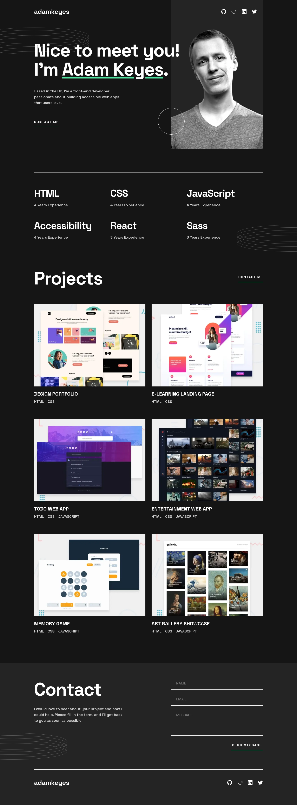
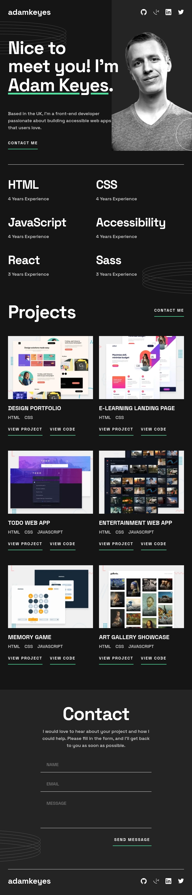
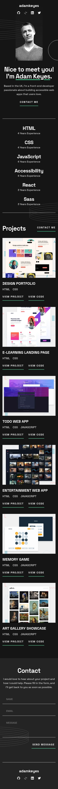

# Frontend Mentor | Single-page developer portfolio
This is my solution to the [Single-page developer portfolio challenge](https://www.frontendmentor.io/challenges/singlepage-developer-portfolio-bBVj2ZPi-x) from [Frontend Mentor](https://www.frontendmentor.io/).

## Tech Stack
 - Angular
 - SCSS

## Developer Tools
 - VS Code
 - Figma

## Links
 - [Website](https://single-page-developer-portfolio.fem.jgerard.dev/) hosted with [Vercel](https://vercel.com/)
 - [Solution](https://www.frontendmentor.io/solutions/singlepage-developer-portfolio-Pf1HpmEttZ)

## Scrolling screenshots
### Desktop

### Tablet

### Mobile

## About Frontend Mentor
[Frontend Mentor](https://www.frontendmentor.io/) challenges help you improve your coding skills by building realistic projects.

## Copyright
© 2023 Johnny Gérard
